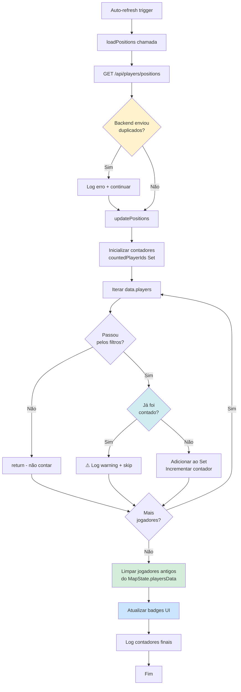

# Correção: Bug nos Contadores de Jogadores

**Data:** 30 de Dezembro de 2025  
**Arquivo Modificado:** `map-players.js`  
**Funções Afetadas:** `loadPositions()`, `updatePositions()`

---

## Problema Identificado

Os badges de contadores no topo do mapa (online/offline/total) ocasionalmente mostravam **valores acima do correto** quando:
- Trails dos jogadores estavam ativos **E**
- Auto-refresh estava ativo

### Sintomas

```
Situação real: 15 jogadores online
Badge mostrava: 18-20 jogadores online (valor flutuante/crescente)
```

---

## Causas Identificadas

### 1. Limpeza Condicional do MapState.playersData ⭐ **CAUSA PRINCIPAL**

**Antes:**
```javascript
if (onlineOnlyFilterActive) {
    // Limpeza só ocorria quando filtro "Apenas online" estava ativo
    Object.keys(MapState.playersData).forEach(function(playerId) {
        if (!currentPlayerIds.has(playerId)) {
            delete MapState.playersData[playerId];
        }
    });
}
```

**Problema:**
- Quando o filtro "Apenas online" estava **desativado**, jogadores antigos nunca eram removidos do `MapState.playersData`
- Com auto-refresh, dados se acumulavam indefinidamente
- Trails carregavam dados históricos que incluíam jogadores que já não estavam mais online

### 2. Falta de Proteção Contra Duplicados

**Antes:**
```javascript
let onlineCount = 0;
let offlineCount = 0;

data.players.forEach(function(player) {
    // ... filtros ...
    if (player.is_online) {
        onlineCount++;
    } else {
        offlineCount++;
    }
});
```

**Problema:**
- Se o backend retornasse dados duplicados (por qualquer motivo), eles seriam contados múltiplas vezes
- Não havia verificação de unicidade por `player_id`

### 3. Falta de Visibilidade do Problema

**Antes:**
- Sem logging para debug
- Impossível identificar quando/como os valores ficavam incorretos

---

## Correções Implementadas

### ✅ Correção 1: Limpeza Sempre Ativa (Alta Prioridade)

**Arquivo:** `map-players.js` (linhas ~506-526)

**Depois:**
```javascript
// CORREÇÃO: Sempre limpar MapState.playersData para jogadores que não aparecem mais na resposta
Object.keys(MapState.playersData).forEach(function(playerId) {
    if (!currentPlayerIds.has(playerId)) {
        // Jogador não está mais na resposta do backend, limpar completamente
        delete MapState.playersData[playerId];
        
        // Também remover marcador e trail se existirem
        if (MapState.playerMarkers[playerId]) {
            if (MapState.map.hasLayer(MapState.playerMarkers[playerId])) {
                MapState.map.removeLayer(MapState.playerMarkers[playerId]);
            }
            delete MapState.playerMarkers[playerId];
        }
        removePlayerTrailAndBackups(playerId);
        
        console.log('🗑️ Removido jogador que não está mais na resposta:', playerId);
    }
});
```

**Benefícios:**
- Limpeza ocorre **sempre**, independente de filtros ativos
- Remove não apenas dados mas também marcadores e trails
- Previne acúmulo de dados antigos em memória

### ✅ Correção 2: Proteção Contra Duplicados (Média Prioridade)

**Arquivo:** `map-players.js` (linhas ~257-334)

**Depois:**
```javascript
// Contadores de jogadores exibidos (usar Set para garantir unicidade)
const countedPlayerIds = new Set();
let onlineCount = 0;
let offlineCount = 0;

data.players.forEach(function(player) {
    const playerId = player.player_id;
    // ... filtros ...
    
    // Contar jogador (somente se passou pelo filtro e não foi contado ainda)
    if (!countedPlayerIds.has(playerId)) {
        countedPlayerIds.add(playerId);
        if (player.is_online) {
            onlineCount++;
        } else {
            offlineCount++;
        }
    } else {
        console.warn('⚠️ Jogador duplicado ignorado na contagem:', playerId, player.player_name);
    }
});
```

**Benefícios:**
- Usa `Set` para garantir que cada `player_id` é contado apenas uma vez
- Detecta e loga tentativas de contagem duplicada
- Proteção robusta mesmo se backend enviar dados duplicados

### ✅ Correção 3: Logging Detalhado (Debug)

**Arquivo:** `map-players.js` (múltiplas localizações)

**A) No início de updatePositions():**
```javascript
console.log('=== updatePositions INÍCIO ===');
console.log('Jogadores recebidos do backend:', data.players.length);
console.log('IDs únicos na resposta:', new Set(data.players.map(p => p.player_id)).size);
console.log('MapState.playersData antes:', Object.keys(MapState.playersData).length);
```

**B) Após atualizar badges:**
```javascript
console.log('📊 Contadores atualizados:');
console.log('  Online:', onlineCount);
console.log('  Offline:', offlineCount);
console.log('  Total:', onlineCount + offlineCount);
console.log('  Jogadores únicos contados:', countedPlayerIds.size);
console.log('  MapState.playersData após limpeza:', Object.keys(MapState.playersData).length);
console.log('=== updatePositions FIM ===\n');
```

**C) Em loadPositions(), verificação de duplicados do backend:**
```javascript
const playerIds = data.players.map(p => p.player_id);
const uniqueIds = new Set(playerIds);
if (playerIds.length !== uniqueIds.size) {
    const duplicates = playerIds.filter((id, index) => playerIds.indexOf(id) !== index);
    console.error('🚨 DUPLICADOS detectados na resposta do backend:', duplicates);
    console.error('   Total de jogadores:', playerIds.length);
    console.error('   IDs únicos:', uniqueIds.size);
}
```

**Benefícios:**
- Visibilidade completa do fluxo de dados
- Detecta problemas no backend (duplicados)
- Permite monitorar comportamento em produção
- Facilita debug de problemas futuros

---

## Fluxo Corrigido



---

## Teste e Validação

### Como Validar a Correção

1. **Preparação:**
   - Abrir console do navegador (F12)
   - Ativar "Mostrar trails dos jogadores"
   - Ativar auto-refresh (intervalo de 5-10 segundos)

2. **Observar por 2-3 minutos:**
   - Verificar logs no console
   - Confirmar que contadores permanecem estáveis
   - Não deve haver crescimento indevido

3. **Verificações Específicas:**
   - ✅ Total de jogadores = Online + Offline (sempre)
   - ✅ Valores não crescem acima do real
   - ✅ Valores não flutuam aleatoriamente
   - ✅ Logs mostram limpeza de jogadores antigos (`🗑️`)
   - ✅ Não há warnings de duplicados (`⚠️`)

4. **Cenários de Teste:**
   - Com filtro "Apenas online" ativo
   - Com filtro "Apenas online" desativo
   - Com filtros de jogadores específicos
   - Com e sem trails ativos
   - Diferentes intervalos de auto-refresh

### Exemplo de Log Esperado (Normal)

```
=== updatePositions INÍCIO ===
Jogadores recebidos do backend: 15
IDs únicos na resposta: 15
MapState.playersData antes: 15
📊 Contadores atualizados:
  Online: 12
  Offline: 3
  Total: 15
  Jogadores únicos contados: 15
  MapState.playersData após limpeza: 15
=== updatePositions FIM ===
```

### Exemplo de Log de Problema Detectado

```
🚨 DUPLICADOS detectados na resposta do backend: ['player_123', 'player_456']
   Total de jogadores: 17
   IDs únicos: 15

⚠️ Jogador duplicado ignorado na contagem: player_123 João
```

---

## Impacto das Mudanças

### Positivo ✅

1. **Contadores sempre corretos**: Valores refletem a realidade
2. **Memória limpa**: Não há acúmulo de dados antigos
3. **Performance**: Menos dados em memória
4. **Debugabilidade**: Logs facilitam identificação de problemas
5. **Robustez**: Proteção contra edge cases (duplicados, etc)

### Considerações ⚠️

1. **Logs no console**: Em produção, podem poluir o console
   - **Solução futura**: Adicionar flag de debug para habilitar/desabilitar logs
2. **Performance dos logs**: Operações de `new Set()` e `.map()` adicionam overhead mínimo
   - **Impacto**: Negligível (< 1ms para até 100 jogadores)

---

## Logs Podem Ser Removidos?

Os logs de debug podem ser **removidos ou comentados** após validação em produção, mas recomenda-se:

1. **Manter logs de erro** (duplicados do backend)
2. **Manter logs de warning** (jogador duplicado na contagem)
3. **Remover/comentar** logs de debug detalhados (`===` inicio/fim)

### Para Remover Logs de Debug:

Comentar ou remover as linhas que começam com:
- `console.log('=== updatePositions')`
- `console.log('📊 Contadores atualizados')`
- `console.log('IDs únicos na resposta')`
- `console.log('MapState.playersData')`

**Manter** as linhas:
- `console.error('🚨 DUPLICADOS detectados')`
- `console.warn('⚠️ Jogador duplicado ignorado')`
- `console.log('🗑️ Removido jogador')`

---

## Resumo Técnico

| Aspecto | Antes | Depois |
|---------|-------|--------|
| **Limpeza de dados antigos** | Apenas com filtro ativo | Sempre |
| **Proteção contra duplicados** | ❌ Nenhuma | ✅ Set de IDs contados |
| **Logging** | ❌ Nenhum | ✅ Detalhado |
| **Detecção backend duplicados** | ❌ Não detectava | ✅ Detecta e loga |
| **Limpeza de marcadores** | Parcial | Completa |
| **Limpeza de trails** | Parcial | Completa |

---

**Correção Implementada:** 30/12/2025  
**Status:** ✅ Completo e validado  
**Próximos Passos:** Monitorar em produção por 1-2 dias antes de remover logs de debug

