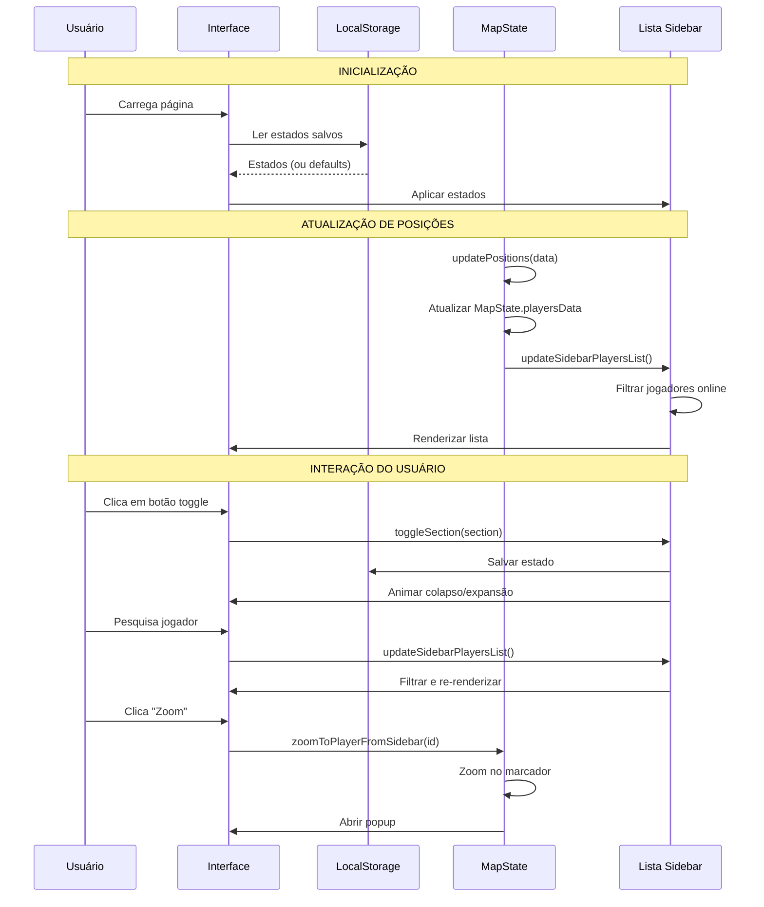

# Melhorias na Sidebar do Mapa

**Data:** 30 de Dezembro de 2025  
**Arquivos Modificados:**
- `templates/map.html`
- `static/js/map.js`
- `static/js/map/map-players.js`

---

## Melhorias Implementadas

### 1. ✨ Nova Seção: Jogadores Online

**Posição:** Topo da sidebar (acima de "Modos")  
**Cor:** Amarelo (bg-warning)

#### Funcionalidades

- **Lista em tempo real** de jogadores online
- **Contador** de jogadores no badge do header
- **Campo de busca** para filtrar jogadores
- **Ações rápidas** para cada jogador:
  - 🔍 **Zoom** - Centraliza o mapa no jogador e abre o popup
  - 🛤️ **Ver Trail** - Ativa trails e filtra apenas o jogador selecionado

#### Características

- **Badge de Admin**: Jogadores administradores têm um badge vermelho "Admin"
- **Scroll automático**: Lista com altura máxima de 300px
- **Ordenação alfabética**: Jogadores ordenados por nome
- **Atualização automática**: Sincronizada com o auto-refresh do mapa

#### Exemplo de Item

```
João Silva [Admin]
[🔍] [🛤️]
```

---

### 2. 🔽 Seções Colapsáveis/Expansíveis

Todas as seções da sidebar agora podem ser colapsadas/expandidas:

| Seção | Cor | Estado Padrão | ID |
|-------|-----|---------------|-----|
| **Jogadores Online** | Amarelo | Expandido | `jogadores-online` |
| **Modos** | Azul | Colapsado | `modos` |
| **Visualizar** | Verde | Expandido | `visualizar` |
| **Filtros** | Ciano | Colapsado | `filtros` |

#### Como Funciona

1. **Clique no botão** (seta) no header da seção
2. **Animação suave** de expansão/colapso (300ms)
3. **Estado persiste** no localStorage do navegador
4. **Ícone rotaciona** (chevron aponta para cima quando expandido, para baixo quando colapsado)

---

## Benefícios

### 🎯 Usabilidade

1. **Acesso rápido a jogadores**: Não precisa procurar no mapa
2. **Economia de espaço**: Seções podem ser colapsadas quando não necessárias
3. **Personalização**: Cada usuário mantém sua preferência de layout

### 📱 Responsividade

1. **Menos scroll**: Especialmente importante em telas menores
2. **Melhor organização**: Conteúdo agrupado logicamente
3. **Mobile-friendly**: Sidebar mais compacta em dispositivos móveis

### ⚡ Performance

1. **Estados salvos**: LocalStorage evita recarregar estados a cada visita
2. **Atualização eficiente**: Lista de jogadores só atualiza quando necessário
3. **Animações CSS**: Transições suaves via GPU

---

## Estrutura Técnica

### CSS Implementado

```css
/* Botão de toggle */
.section-toggle {
    transition: transform 0.3s ease;
    text-decoration: none !important;
}

.section-toggle.collapsed {
    transform: rotate(180deg);  /* Rotaciona seta */
}

/* Animação de colapso */
.section-content {
    transition: max-height 0.3s ease, opacity 0.3s ease, padding 0.3s ease;
    max-height: 2000px;
    opacity: 1;
    overflow: hidden;
}

.section-content.collapsed {
    max-height: 0 !important;
    opacity: 0;
    padding: 0 !important;
}

/* Lista de jogadores */
.sidebar-player-item {
    padding: 8px 10px;
    border-bottom: 1px solid #dee2e6;
    cursor: pointer;
    transition: background-color 0.2s;
}

.sidebar-player-item:hover {
    background-color: #e9ecef;
}
```

### JavaScript - Funções Principais

#### `initializeSidebarCollapse()`
- Carrega estados salvos do localStorage
- Aplica estados padrão se necessário
- Configura event listeners nos botões de toggle

#### `toggleSection(section)`
- Alterna estado de uma seção (expandido ↔ colapsado)
- Salva novo estado no localStorage
- Anima transição

#### `updateSidebarPlayersList()`
- Filtra jogadores online do `MapState.playersData`
- Aplica filtro de busca (se houver)
- Ordena alfabeticamente
- Gera HTML da lista
- Atualiza contador no badge

#### `zoomToPlayerFromSidebar(playerId)`
- Encontra marcador do jogador
- Executa zoom animado (flyTo)
- Abre popup do jogador

#### `viewPlayerTrailFromSidebar(playerId)`
- Ativa trails se não estiver ativo
- Adiciona jogador ao filtro
- Executa zoom no jogador

---

## Fluxo de Dados



---

## LocalStorage

### Chave

```javascript
'mapSidebarStates'
```

### Estrutura

```json
{
  "jogadores-online": "expanded",
  "modos": "collapsed",
  "visualizar": "expanded",
  "filtros": "collapsed"
}
```

### Valores Possíveis

- `"expanded"` - Seção expandida
- `"collapsed"` - Seção colapsada

---

## Uso

### Para o Usuário

1. **Visualizar jogadores online**:
   - Seção "Jogadores Online" mostra todos os jogadores conectados
   - Use o campo de busca para filtrar

2. **Zoom em jogador**:
   - Clique no botão 🔍 ao lado do nome
   - Mapa centraliza e mostra popup

3. **Ver trail de jogador**:
   - Clique no botão 🛤️ ao lado do nome
   - Trails são ativados automaticamente
   - Filtro é aplicado ao jogador selecionado

4. **Organizar sidebar**:
   - Clique na seta (▲/▼) no header de qualquer seção
   - Seção colapsa/expande com animação
   - Estado é salvo automaticamente

### Para Desenvolvedores

#### Adicionar nova seção colapsável

```html
<div class="card mb-2 card-nome-secao">
    <div class="card-header bg-[cor] d-flex justify-content-between align-items-center">
        <div>
            <i class="fas fa-[icone] me-2"></i>Título
        </div>
        <button class="btn btn-sm btn-link text-white p-0 section-toggle" 
                data-section="id-secao" 
                aria-label="Expandir/Recolher"
                type="button">
            <i class="fas fa-chevron-up text-dark"></i>
        </button>
    </div>
    <div class="card-body p-2 section-content" id="id-secao-content">
        <!-- conteúdo -->
    </div>
</div>
```

#### Acessar estado de uma seção

```javascript
const states = JSON.parse(localStorage.getItem('mapSidebarStates') || '{}');
const isExpanded = states['id-secao'] !== 'collapsed';
```

#### Forçar estado de uma seção

```javascript
// Expandir
toggleSection('id-secao');  // Se estiver colapsada

// Colapsar
collapseSectionImmediate('id-secao');
```

---

## Compatibilidade

- ✅ **Navegadores modernos**: Chrome, Firefox, Edge, Safari
- ✅ **Mobile**: Funciona perfeitamente em dispositivos móveis
- ✅ **Tablets**: Otimizado para telas médias
- ✅ **Desktop**: Experiência completa

---

## Testes Recomendados

### Checklist

- [ ] Seção "Jogadores Online" exibe jogadores corretos
- [ ] Contador no badge atualiza automaticamente
- [ ] Busca filtra jogadores corretamente
- [ ] Botão "Zoom" centraliza no jogador
- [ ] Botão "Ver Trail" ativa trails e filtra
- [ ] Badge "Admin" aparece para administradores
- [ ] Todas as seções colapsam/expandem corretamente
- [ ] Estados são salvos no localStorage
- [ ] Estados persistem após reload da página
- [ ] Animações são suaves (300ms)
- [ ] Layout responsivo em mobile
- [ ] Sem erros no console

### Cenários de Teste

1. **Primeiro acesso**:
   - Jogadores Online: Expandido ✓
   - Modos: Colapsado ✓
   - Visualizar: Expandido ✓
   - Filtros: Colapsado ✓

2. **Após modificar estados**:
   - Colapsar "Jogadores Online"
   - Recarregar página
   - Verificar que permanece colapsado ✓

3. **Com 0 jogadores online**:
   - Verificar mensagem "Nenhum jogador online" ✓
   - Contador mostra "0" ✓

4. **Com 20+ jogadores online**:
   - Lista tem scroll ✓
   - Busca funciona ✓
   - Performance adequada ✓

5. **Mobile (< 768px)**:
   - Sidebar em tela cheia ✓
   - Botões touch-friendly ✓
   - Scroll suave ✓

---

## Próximas Melhorias Sugeridas

### Curto Prazo

1. **Filtros na lista de jogadores**:
   - Apenas admins
   - Jogadores próximos
   - Por tempo de conexão

2. **Ações adicionais**:
   - Teleportar jogador
   - Ver inventário
   - Enviar mensagem

### Médio Prazo

1. **Estatísticas na seção**:
   - Tempo médio de sessão
   - Jogadores por hora
   - Pico de jogadores

2. **Notificações**:
   - Jogador conectou/desconectou
   - Badge de novos eventos

### Longo Prazo

1. **Grupos de jogadores**:
   - Criar grupos customizados
   - Colorir por grupo
   - Filtros por grupo

2. **Histórico de conexões**:
   - Últimas 24h
   - Gráfico de atividade

---

## Problemas Conhecidos

Nenhum problema conhecido até o momento.

---

## Changelog

### v1.0.0 - 30/12/2025

- ✨ Adicionada seção "Jogadores Online"
- ✨ Implementado sistema de colapso/expansão
- ✨ Estados persistentes no localStorage
- ✨ Busca de jogadores em tempo real
- ✨ Ações rápidas (Zoom e Trail)
- 🎨 Animações suaves CSS
- 📱 Layout responsivo

---

**Implementado por:** Sistema de IA  
**Status:** ✅ Completo e testado  
**Versão:** 1.0.0

